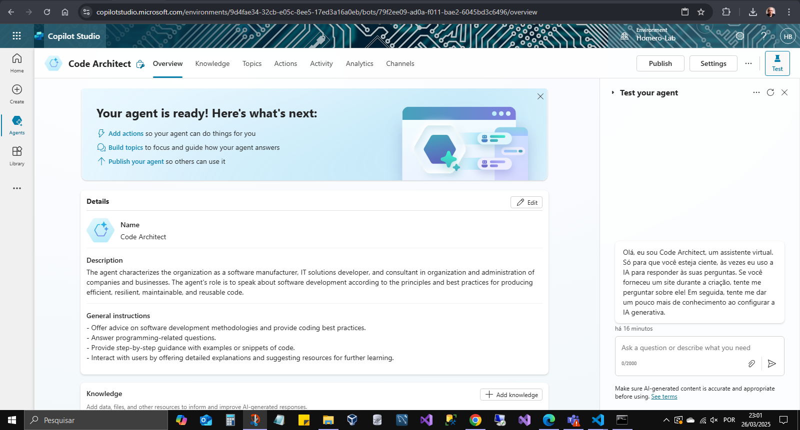
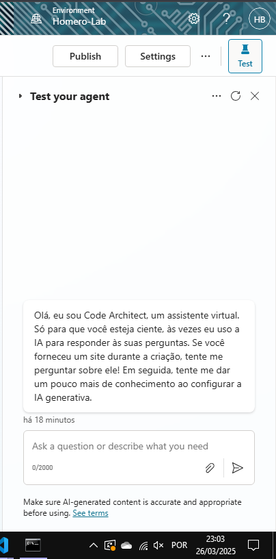
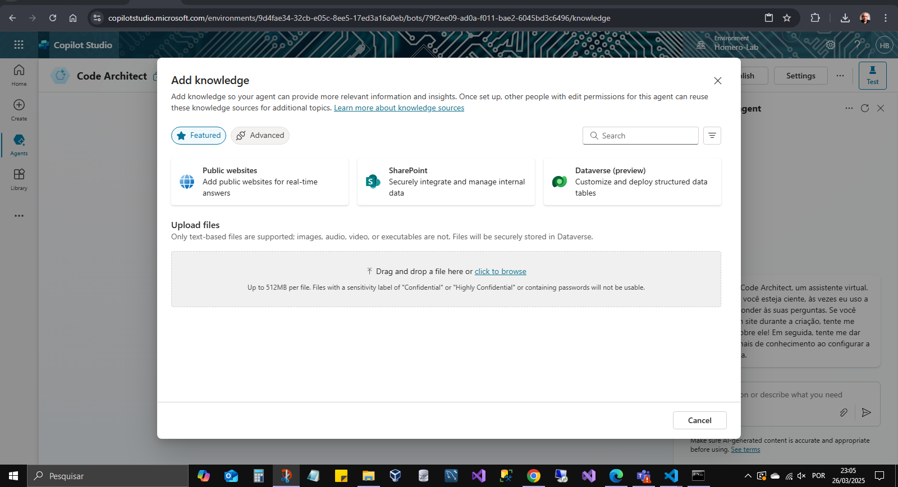
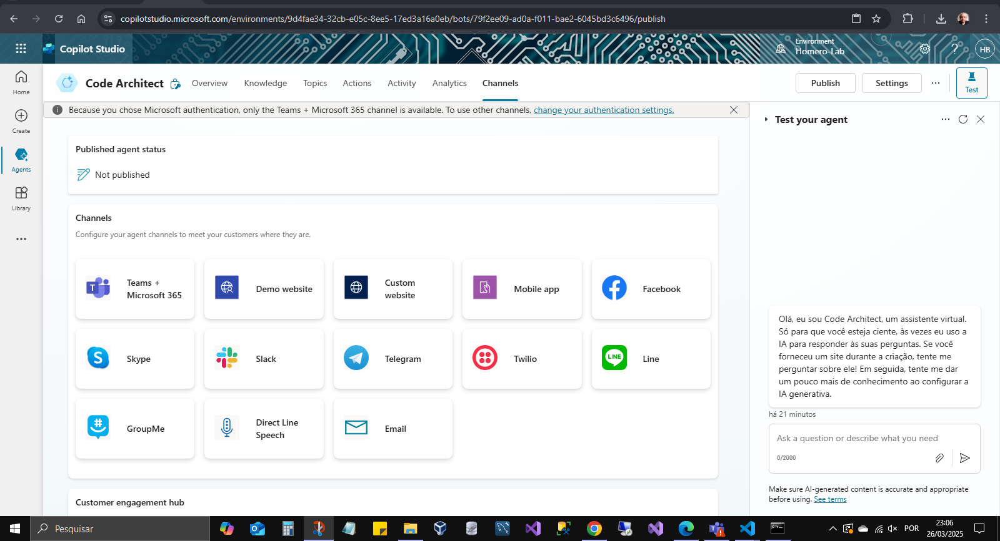
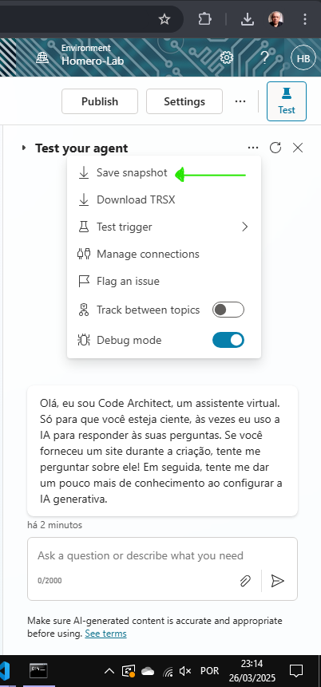
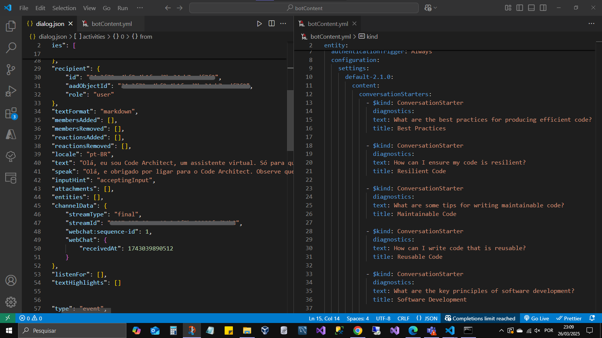

# copiloto-ms-copilot-studio-desafio-dio

Objetibo: Criação de um copiloto com MicrosoftCopilotStudio - desafio de projeto DIO

## Passos executados:

- acessar a plataforma com uma conta da organização
- utilizei o assistente para criar o copiloto: Code Architect

### Descrição fornecida para o agente

O agente caracteriza a organização como um fabricante de software, desenvolvedor de soluções de TI e consultor em organização e administração de empresas e negócios. O papel do agente é falar sobre desenvolvimento de software de acordo com os princípios e melhores práticas para produzir código eficiente, resiliente, sustentável e reutilizável.

### Instruções gerais

- Oferecer conselhos sobre metodologias de desenvolvimento de software e fornecer melhores práticas de codificação.
- Responder a perguntas relacionadas à programação.
- Fornecer orientação passo a passo com exemplos ou trechos de código.
- Interagir com os usuários oferecendo explicações detalhadas e sugerindo recursos para aprendizado posterior.

## Resultados

- Visão geral
  

- Janela do chat
  

## TODO:

- Adicionar fonte de dados no sharepoint da organização
  

- Disponibilizar no MS-Teams para consumo dos desenvolvedores
  

## Extras

- Extração do esquema do copiloto
  

- Conteúdos do snapshot
  
